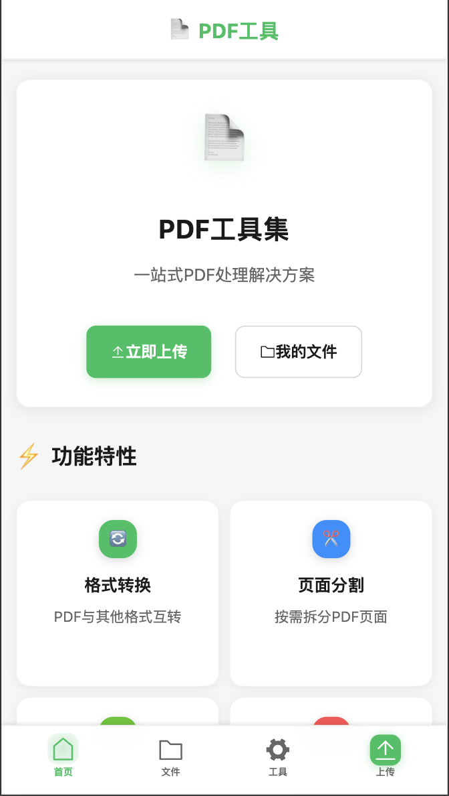
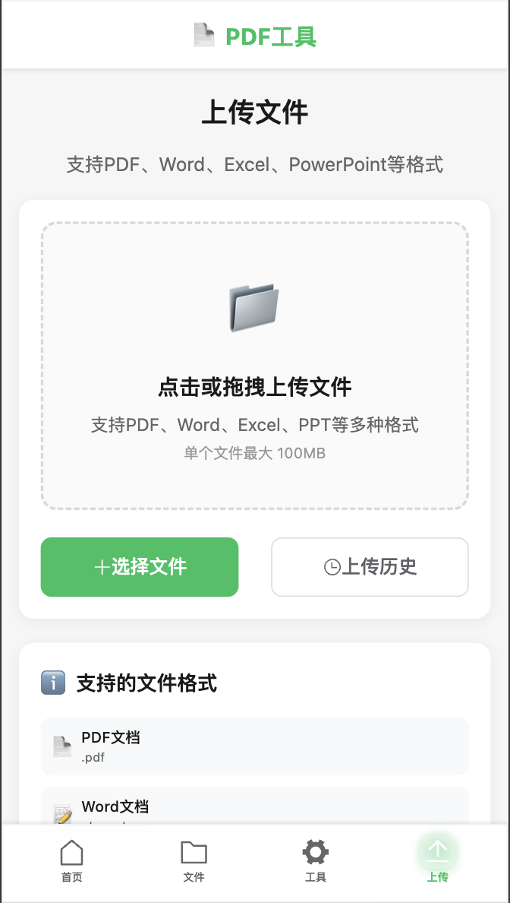
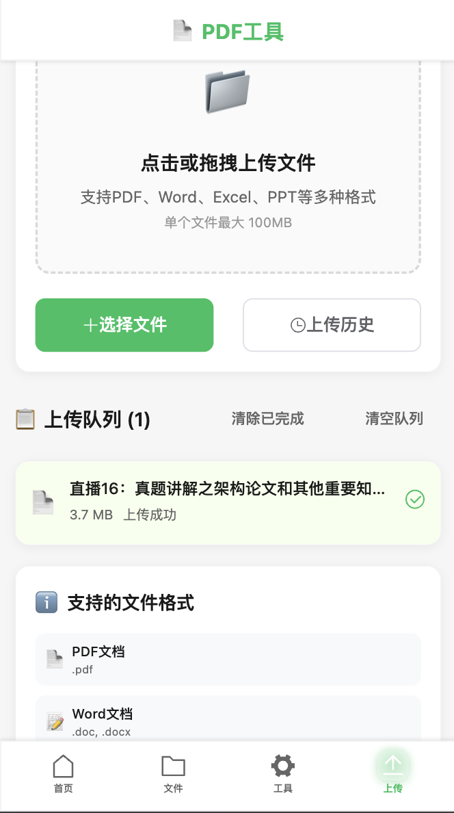
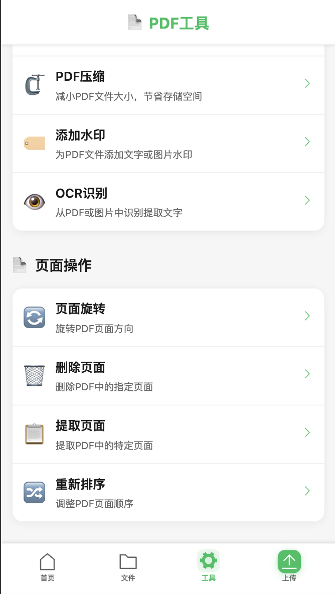
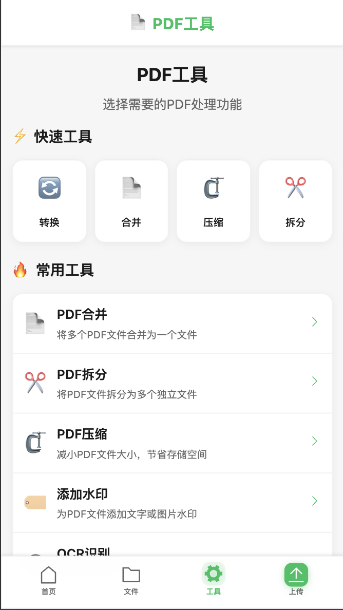

# PDF工具应用

基于Stirling-PDF设计理念开发的现代化PDF处理工具，提供全面的PDF操作功能。

## 📱 项目演示

### 移动端界面展示

<div align="center">

#### 🏠 主页和工具集



#### 📁 文件管理




#### 🛠️ PDF工具



#### ✅ 操作反馈


</div>

> 📸 更多演示截图请查看 [screenshots](./screenshots/) 目录

## ✨ 功能特性

- 🔄 **PDF操作**: 合并、拆分、旋转、重排页面
- 🖼️ **格式转换**: PDF与图片、文档格式互转
- 🔒 **安全功能**: 密码保护、权限设置、数字签名
- 🤖 **OCR识别**: 图片文字识别转可编辑文本
- 📁 **批量处理**: 支持多文件并行处理
- 🎨 **水印添加**: 文字和图片水印
- 🔍 **文档比较**: 比较PDF文档差异
- 📊 **元数据编辑**: 修改PDF属性信息

## 🏗️ 技术架构

### 后端技术栈
- **Spring Boot 3.x** - 应用框架
- **Apache PDFBox** - PDF处理核心
- **Spring Security** - 安全认证
- **PostgreSQL/H2** - 数据存储
- **Nginx** - 反向代理

### 前端技术栈
- **Vue.js 3** - 前端框架
- **Element Plus** - UI组件库
- **PDF.js** - PDF预览
- **Vite** - 构建工具

## 🚀 快速开始

### 环境要求
- Java 17+
- Node.js 16+
- Nginx (生产环境)

### 本地开发

1. **克隆项目**
```bash
git clone <repository-url>
cd pdf_tool
```

2. **后端启动**
```bash
# 使用Gradle
./gradlew bootRun

# 或使用Maven
./mvnw spring-boot:run
```

3. **前端启动**
```bash
cd frontend
npm install
npm run dev
```

4. **访问应用**
- 前端: http://localhost:3000
- 后端API: http://localhost:8080
- API文档: http://localhost:8080/swagger-ui.html

### 生产部署

```bash
# 一键部署到生产环境
./start-native.sh

# 或使用完整部署脚本
./deploy-native.sh
```

## 📁 项目结构

```
pdf_tool/
├── backend/                 # 后端Spring Boot项目
│   ├── src/main/java/
│   ├── src/main/resources/
│   └── build.gradle
├── frontend/                # 前端Vue.js项目
│   ├── src/
│   ├── public/
│   └── package.json
├── start-native.sh          # 生产环境启动脚本
├── deploy-native.sh         # 完整部署脚本
└── README.md
```

## 🔧 配置说明

### 环境变量
```bash
# 数据库配置
DB_HOST=localhost
DB_PORT=5432
DB_NAME=pdfapp
DB_USER=pdfuser
DB_PASSWORD=password

# 文件存储
UPLOAD_PATH=/app/uploads
MAX_FILE_SIZE=100MB

# OCR配置
TESSERACT_PATH=/usr/bin/tesseract
OCR_LANGUAGES=eng,chi_sim

# 安全配置
JWT_SECRET=your-secret-key
CORS_ORIGINS=http://localhost:3000
```

### 功能开关
```yaml
# application.yml
pdf:
  features:
    ocr-enabled: true
    batch-processing: true
    user-management: false
    file-encryption: true
```

## 📋 开发路线图

- [x] 项目初始化和架构设计
- [ ] 基础文件上传下载
- [ ] PDF基础操作(合并/拆分)
- [ ] 格式转换功能
- [ ] 安全功能实现
- [ ] OCR集成
- [ ] 批量处理
- [ ] 用户管理系统
- [ ] API文档完善
- [ ] 性能优化

## 🤝 贡献指南

1. Fork 项目
2. 创建功能分支 (`git checkout -b feature/AmazingFeature`)
3. 提交更改 (`git commit -m 'Add some AmazingFeature'`)
4. 推送到分支 (`git push origin feature/AmazingFeature`)
5. 打开 Pull Request

## 📄 许可证

本项目采用 MIT 许可证 - 查看 [LICENSE](LICENSE) 文件了解详情

## 🙏 致谢

- [Stirling-PDF](https://github.com/Stirling-Tools/Stirling-PDF) - 功能设计参考
- [Apache PDFBox](https://pdfbox.apache.org/) - PDF处理库
- [PDF.js](https://mozilla.github.io/pdf.js/) - PDF预览组件

## 📞 联系方式

- 项目主页: [GitHub Repository]
- 问题反馈: [Issue Tracker]
- 邮箱: support@yourcompany.com

## 🛠️ 后端API接口调用方式

### 1. PDF转Word
- **接口**：`POST /api/pdf-tools/to-word`
- **参数**：`file` (PDF文件，multipart/form-data)
- **返回**：
```json
{
  "success": true,
  "message": "PDF转Word成功",
  "fileId": 123,
  "algorithm": "文本提取 + Apache POI"
}
```

### 2. PDF转Excel
- **接口**：`POST /api/pdf-tools/to-excel`
- **参数**：`file` (PDF文件，multipart/form-data)
- **返回**：
```json
{
  "success": true,
  "message": "PDF转Excel成功",
  "fileId": 123,
  "algorithm": "Tabula表格识别 + Apache POI"
}
```

### 3. PDF转CSV
- **接口**：`POST /api/pdf-tools/to-csv`
- **参数**：`file` (PDF文件，multipart/form-data)
- **返回**：
```json
{
  "success": true,
  "message": "PDF转CSV成功",
  "fileId": 123,
  "algorithm": "Tabula表格识别 + OpenCSV"
}
```

### 4. PDF转图片
- **接口**：`POST /api/pdf-tools/pdf-to-images`
- **参数**：
  - `file` (PDF文件，multipart/form-data)
  - `format` (图片格式，默认PNG，可选JPG)
  - `dpi` (分辨率，默认200)
- **返回**：
```json
{
  "success": true,
  "message": "PDF转图片成功",
  "data": [
    { "fileId": 101, "fileName": "xxx_page1.png", "fileSize": 12345, "fileType": "PNG" },
    { "fileId": 102, "fileName": "xxx_page2.png", "fileSize": 12345, "fileType": "PNG" }
  ],
  "count": 2
}
```

### 5. Word转PDF
- **接口**：`POST /api/pdf-tools/word-to-pdf`
- **参数**：`file` (Word文件，multipart/form-data)
- **返回**：
```json
{
  "success": true,
  "message": "Word转PDF成功",
  "data": { "fileId": 123 }
}
```

### 6. Excel转PDF
- **接口**：`POST /api/pdf-tools/excel-to-pdf`
- **参数**：`file` (Excel文件，multipart/form-data)
- **返回**：
```json
{
  "success": true,
  "message": "Excel转PDF成功",
  "data": { "fileId": 123 }
}
```

### 7. PDF转PPT
- **接口**：`POST /api/pdf-tools/pdf-to-ppt`
- **参数**：`file` (PDF文件，multipart/form-data)
- **返回**：
```json
{
  "success": true,
  "message": "PDF转PPT成功",
  "data": { "fileId": 123 }
}
```

---

**调用示例（curl）：**
```bash
curl -X POST http://localhost:8080/api/pdf-tools/to-word \
  -F "file=@/path/to/your/test.pdf"

curl -X POST http://localhost:8080/api/pdf-tools/pdf-to-images \
  -F "file=@/path/to/your/test.pdf" -F "format=PNG" -F "dpi=200"
```

如需更多接口说明或批量处理、文件下载等用法，请查阅源码或联系开发者。

---

**⭐ 如果这个项目对您有帮助，请给我们一个 Star！**

## 🛠️ 工具页面功能API接口文档

### 1. 文件上传
- **接口**：`POST /api/files/upload`
- **参数**：`file` (任意支持的文件，multipart/form-data)
- **返回**：
```json
{
  "success": true,
  "data": { "fileId": 123, "originalName": "test.pdf", "fileSize": 12345, "fileType": "PDF" }
}
```
- **示例**：
```bash
curl -X POST http://localhost:8080/api/files/upload -F "file=@/path/to/your/test.pdf"
```

---

### 2. PDF合并
- **接口**：`POST /api/pdf-tools/merge`
- **参数**：
  - `fileIds` (int数组，待合并PDF文件ID)
  - `outputFileName` (可选，合并后文件名)
- **返回**：
```json
{
  "success": true,
  "data": { "fileId": 123, "fileName": "merged.pdf", "fileSize": 12345 }
}
```
- **示例**：
```bash
curl -X POST http://localhost:8080/api/pdf-tools/merge \
  -H "Content-Type: application/json" \
  -d '{"fileIds":[1,2,3], "outputFileName":"merged.pdf"}'
```

---

### 3. PDF拆分
- **接口**：`POST /api/pdf-tools/split`
- **参数**：
  - `fileId` (int，PDF文件ID)
  - `splitType` (string，'pages' 或 'range')
  - `options` (object，按页数如`{"pageCount":2}`，按范围如`{"ranges":[{"start":1,"end":5}]}`)
- **返回**：
```json
{
  "success": true,
  "data": [ { "fileId": 201, "fileName": "split_1.pdf" }, ... ]
}
```

---

### 4. PDF压缩
- **接口**：`POST /api/pdf-tools/compress`
- **参数**：
  - `fileId` (int，PDF文件ID)
  - `compressionLevel` (string，'low'/'medium'/'high')
- **返回**：
```json
{
  "success": true,
  "data": { "fileId": 301, "fileName": "compressed.pdf" }
}
```

---

### 5. PDF转Word
- **接口**：`POST /api/pdf-tools/to-word/{fileId}` 或 `POST /api/pdf-tools/to-word` (上传文件)
- **参数**：
  - `fileId` (路径参数，已上传文件)
  - 或 `file` (multipart/form-data)
- **返回**：
```json
{
  "success": true,
  "data": { "fileId": 401, "fileName": "converted.docx" }
}
```

---

### 6. PDF转Excel
- **接口**：`POST /api/pdf-tools/to-excel/{fileId}` 或 `POST /api/pdf-tools/to-excel`
- **参数**：同上
- **返回**：同上

---

### 7. PDF转图片
- **接口**：`POST /api/pdf-tools/to-images`
- **参数**：
  - `fileId` (int，PDF文件ID)
  - `imageFormat` (string，PNG/JPG等)
  - `dpi` (int，分辨率)
  - `pageRange` (string，'all'或'custom')
  - `customRange` (string，页码范围如'1-5,8')
- **返回**：
```json
{
  "success": true,
  "data": [ { "fileId": 501, "fileName": "page1.png" }, ... ]
}
```

---

### 8. 图片转PDF
- **接口**：`POST /api/pdf-tools/from-images`
- **参数**：
  - `imageFileIds` (int数组，图片文件ID)
  - `outputFileName` (可选)
- **返回**：
```json
{
  "success": true,
  "data": { "fileId": 601, "fileName": "images_to_pdf.pdf" }
}
```

---

### 9. 页面旋转
- **接口**：`POST /api/pdf-tools/rotate`
- **参数**：
  - `fileId` (int)
  - `pageRange` (string)
  - `customRange` (string)
  - `rotation` (int，90/180/270)
- **返回**：
```json
{
  "success": true,
  "data": { "fileId": 701, "fileName": "rotated.pdf" }
}
```

---

### 10. 删除页面
- **接口**：`POST /api/pdf-tools/delete-pages`
- **参数**：
  - `fileId` (int)
  - `pageRange` (string)
  - `customRange` (string)
- **返回**：
```json
{
  "success": true,
  "data": { "fileId": 801, "fileName": "deleted.pdf" }
}
```

---

### 11. 提取页面
- **接口**：`POST /api/pdf-tools/extract-pages`
- **参数**：同上
- **返回**：同上

---

### 12. 重新排序页面
- **接口**：`POST /api/pdf-tools/reorder-pages`
- **参数**：
  - `fileId` (int)
  - `pageOrder` (int数组，新顺序)
- **返回**：
```json
{
  "success": true,
  "data": { "fileId": 901, "fileName": "reordered.pdf" }
}
```

---

### 13. 添加水印
- **接口**：
  - 文字水印：`POST /api/pdf-tools/watermark`
  - 图片水印：`POST /api/pdf-tools/watermark-with-image`
- **参数**：
  - `fileId` (int)
  - `watermarkOptions` (object，见下)
  - 图片水印需`watermarkImage` (File)
- **watermarkOptions示例**：
```json
{
  "watermarkType": "text", // 或"image"
  "watermarkText": "Confidential",
  "watermarkPosition": "center",
  "watermarkOpacity": 50,
  "watermarkSize": 24,
  "watermarkColor": "#666666",
  "watermarkRotation": 0,
  "pageRange": "all",
  "customRange": "1-5"
}
```

---

### 14. PDF加密
- **接口**：`POST /api/pdf-tools/encrypt`
- **参数**：
  - `fileId` (int)
  - `userPassword` (string)
  - `ownerPassword` (string，可选)
- **返回**：
```json
{
  "success": true,
  "data": { "fileId": 1001, "fileName": "encrypted.pdf" }
}
```

---

### 15. PDF解密
- **接口**：`POST /api/pdf-tools/decrypt`
- **参数**：
  - `fileId` (int)
  - `password` (string)
- **返回**：同上

---

### 16. 内容编辑（涂黑）
- **接口**：`POST /api/pdf-tools/redact`
- **参数**：
  - `fileId` (int)
  - `keywords` (string数组)
  - `pageRange` (string，可选)
  - `customRange` (string，可选)
- **返回**：同上

---

### 17. OCR文字识别
- **接口**：`POST /api/pdf-tools/ocr/{fileId}?language=chi_sim` 或 `POST /api/pdf-tools/ocr` (上传文件)
- **参数**：
  - `fileId` (路径参数)
  - `language` (string，语言代码如'chi_sim','eng')
- **返回**：
```json
{
  "success": true,
  "data": { "text": "识别结果..." }
}
```

---

### 18. 数字签名
- **接口**：`POST /api/pdf-tools/digital-sign`
- **参数**：
  - `fileId` (int)
  - `signerName` (string)
  - `reason` (string，可选)
  - `location` (string，可选)
  - `pageRange` (string，可选)
  - `customRange` (string，可选)
- **返回**：
```json
{
  "success": true,
  "data": { "fileId": 1101, "fileName": "signed.pdf" }
}
```

---

### 19. 文件下载
- **接口**：`GET /api/files/{fileId}/download`
- **参数**：
  - `fileId` (路径参数)
- **返回**：文件流

---

**错误处理说明**：
- 401 未授权，403 禁止访问，404 资源不存在，500 服务器错误，均返回：
```json
{
  "success": false,
  "message": "错误描述"
}
```

---

如需更多接口细节或批量处理用法，请查阅源码或联系开发者。 